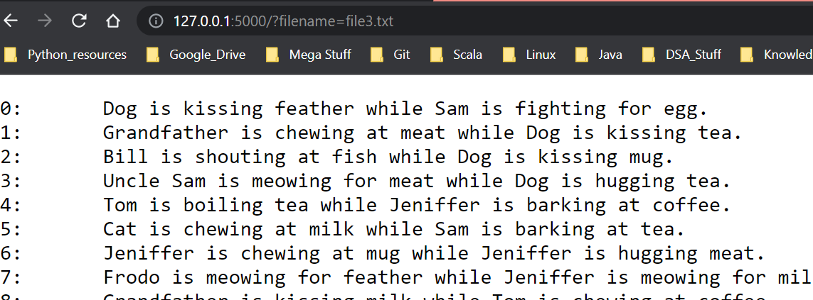
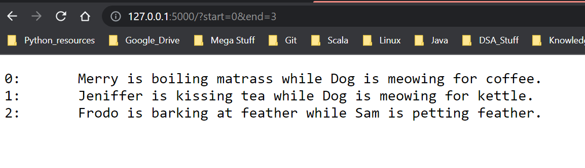
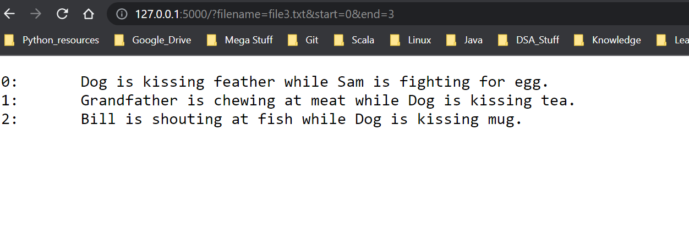

<h1 align="center">
Vetty Flask Project
</h1>

<h3 align="center">

[Installation](https://github.com/Elvis020/Vetty_Flask_Proj#installation) - [Overview](https://github.com/Elvis020/Vetty_Flask_Proj#overview)- [Screenshots](https://github.com/Elvis020/Vetty_Flask_Proj#screenshots)

</h3>

## Installation

To test the project<br>

* ```git clone https://github.com/Elvis020/Vetty_Flask_Proj.git```
* ```cd Vetty_Flask_Proj/```
* ```pip install -r REQUIREMENTS.txt```

## Overview

This is a flask application that has a single GET route for reading files(file1.txt,file2.txt,file3.txt,file4.txt).The endpoints accept optional URL params such as: `filename=<name-of-file>`, `start=<start-page>&end=<end-page>`

The endpoint defaults to open and display file1.txt if none of the url params are supplied.


### Screenshots
<br>



<hr>



<hr>

